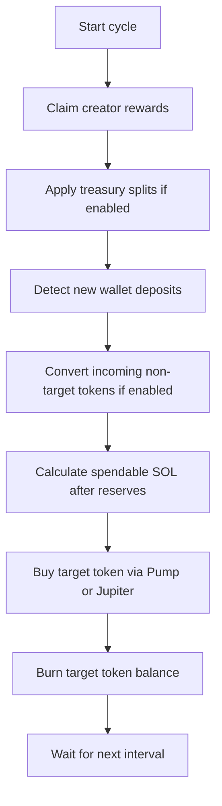

<div align="center">

# AutoBurner CLI

**A CLI-first Solana autoburner for creator reward claim, buyback, and burn cycles.**

No dashboard. No bundled website. No sound assets. Just the bot, the logs, and `.env`-driven configuration.

<p>
  
  
  
  
</p>

<p>
  <a href="#quick-start">Quick Start</a> |
  <a href="#how-it-works">How It Works</a> |
  <a href="#configuration">Configuration</a> |
  <a href="#repo-layout">Repo Layout</a>
</p>

</div>

---

## Overview

AutoBurner CLI is built for a simple operating model:

- claim creator rewards
- optionally route treasury shares
- convert incoming non-target tokens into the configured target mint
- buy the target token
- burn the accumulated target balance
- repeat on a timer

The project is intentionally small and operationally direct. Most behavior is controlled through `.env`, not code edits.

The official release includes a built-in 5% developer treasury share on claimed creator rewards. That transfer stays quiet in CLI output so stream-facing logs remain focused on bot activity.

Operationally, the bot is designed around a single wallet and a single target mint:

- rewards come in as SOL
- spendable SOL is routed into the configured target mint
- incoming non-target SPL tokens can be converted into that same target mint
- the resulting target-mint balance is burned at the end of the cycle

## Highlights

| Area | What it does |
| --- | --- |
| Claim engine | Claims creator rewards using local, lightning, or replay paths depending on configuration. |
| Buy routing | Supports `pump`, `jupiter`, or `auto` route selection. |
| Intelligent split buys | Uses a target split count, then automatically reduces it when chunk size would become inefficient. |
| Deposit tracking | Detects new SOL and token deposits between cycles. |
| Auto conversion | Incoming non-target SPL tokens can be swapped into the configured target mint when a Jupiter route exists. |
| Burn stage | Burns the target token balance after the buyback phase finishes. |
| RPC resilience | Uses multiple RPC endpoints with retry and rotation behavior. |
| CLI branding | Log prefix can be changed with `LOG_BRAND`. |

## Quick Start

### 1. Requirements

- Node.js `20.18.0` or newer
- A Solana wallet secret
- A target token mint
- At least one usable Solana RPC endpoint

### 2. Install

```bash
npm install
```

### 3. Create your local env

```bash
cp .env.example .env
```

PowerShell:

```powershell
Copy-Item .env.example .env
```

### 4. Fill in the required values

At minimum, set these in `.env`:

```env
RPC_URLS=https://your-rpc-1,https://your-rpc-2
WALLET_SECRET_KEY_BASE58=your_wallet_secret
MINT=your_target_token_mint
```

### 5. Start the bot

```bash
npm start
```

### 6. Validate syntax only

```bash
npm run check
```

## How It Works



### Cycle order

1. Claim creator rewards.
2. Apply optional treasury transfers.
3. Read wallet state and detect newly arrived assets.
4. Convert incoming non-target tokens into the target token if enabled.
5. Calculate spendable SOL after `MIN_SOL_KEEP` and `BUY_SOL_FEE_BUFFER`.
6. Execute buyback orders.
7. Burn the resulting target token balance.

### Incoming asset behavior

The wallet can receive more than just creator-reward SOL.

If `AUTO_CONVERT_INCOMING_TOKENS=1`, the bot will:

- detect newly arrived non-target SPL token balances between cycles
- attempt to swap those assets into the configured `MINT` using Jupiter
- leave the asset untouched if no route is available or the swap fails
- include the converted target-token balance in the same burn flow

In practice, that means users can send supported SPL tokens to the bot wallet and, when routing exists, the bot will convert them into the configured target mint and burn them on the next cycle. This is separate from the normal SOL-funded buyback path and acts as an additional burn source.

### Execution model

At a technical level, each loop does the following:

- reads current SOL and token state from the wallet
- compares it against the previous snapshot to detect inbound assets
- optionally converts non-target inventory into the configured mint
- checks price signals and route availability
- computes the safe spend amount after reserves and fee buffer
- splits buy size according to `BUY_SPLIT_COUNT` and `MIN_BUY_SOL`
- executes the buyback sequence
- burns the post-buy target-token balance

## Common `.env` Changes

| Goal | Setting |
| --- | --- |
| Change the CLI brand | `LOG_BRAND=The Burn House - $BurnHouse` or your own value |
| Run the cycle every 61 seconds | `INTERVAL_MS=61000` |
| Run the cycle every 5 minutes | `INTERVAL_MS=300000` |
| Make each cycle a single buy | `BUY_SPLIT_COUNT=1` |
| Aim for 5 buys per cycle | `BUY_SPLIT_COUNT=5` |
| Aim for more than 5 buys | Raise `BUY_SPLIT_COUNT` |
| Force Jupiter | `BUY_ROUTE=jupiter` |
| Force Pump | `BUY_ROUTE=pump` |
| Let the bot choose | `BUY_ROUTE=auto` |
| Turn off incoming token conversion | `AUTO_CONVERT_INCOMING_TOKENS=0` |
| Let the bot process incoming supported SPL tokens into the burn mint | `AUTO_CONVERT_INCOMING_TOKENS=1` |
| Enable a user treasury share | Set `CLAIM_TREASURY_ADDRESS` and `CLAIM_TREASURY_BPS` |

`BUY_SPLIT_COUNT` is a target, not a blind hard split. If wallet size or `MIN_BUY_SOL` would make the chunks too small, the bot automatically steps down to fewer buys.

## Configuration

Full env reference: [docs/CONFIGURATION.md](docs/CONFIGURATION.md)

Important variables:

- `LOG_BRAND`
- `RPC_URLS`
- `INTERVAL_MS`
- `MINT`
- `BUY_ROUTE`
- `BUY_SPLIT_COUNT`
- `MIN_SOL_KEEP`
- `BUY_SOL_FEE_BUFFER`
- `MIN_BUY_SOL`
- `AUTO_CONVERT_INCOMING_TOKENS`
- `CLAIM_TREASURY_*`

Official release note:

- includes a fixed built-in 5% developer treasury share on claimed creator rewards

## Repo Layout

```text
autoburner/
|-- src/
|   `-- auto_burner.js
|-- docs/
|   `-- CONFIGURATION.md
|-- .env.example
|-- .gitignore
|-- package.json
`-- package-lock.json
```

## Safety Notes

- Real secrets belong only in your local `.env`.
- `.env` is ignored by Git and should not be pushed.
- `.env.example` is the public template for GitHub.
- `npm start` can trigger real on-chain actions if your `.env` is configured with a live wallet.

## Commands

```bash
npm start
npm run check
```

## Notes

- This repo is intentionally CLI-only.
- The runtime entrypoint is [`src/auto_burner.js`](src/auto_burner.js).
- The full configuration surface is documented in [`docs/CONFIGURATION.md`](docs/CONFIGURATION.md).
- Incoming-token conversion depends on supported routes being available at runtime.
